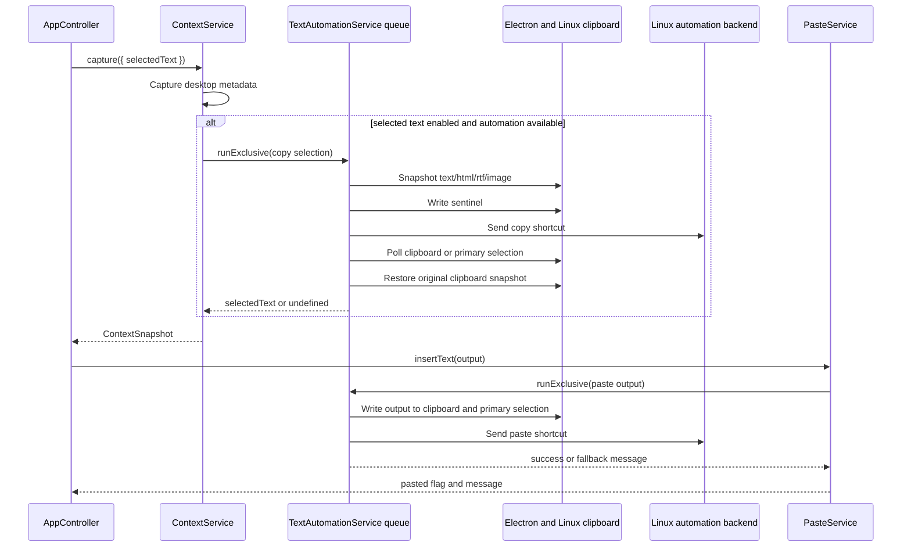

# Context and Automation

Context capture combines active-window metadata, selected text, and recent clipboard text. Paste automation uses the same serialized text-automation queue so copy and paste shortcuts do not overlap.

## Desktop Metadata

[`DesktopMetadataService`](../../src/main/services/context-metadata.ts) supports Linux metadata backends:

- X11 through `xdotool` and `xprop`.
- Hyprland through `hyprctl`.
- GNOME Shell through `gdbus` and `org.gnome.Shell.Eval`.
- KDE KWin through `qdbus` or `qdbus6` plus a temporary KWin script callback.

The capability report advertises active app metadata when at least one backend is detected. Focused text and browser-domain capability flags are currently reported as unavailable, although the shared `ContextSnapshot` type has fields for them.

## Selected Text

Selected-text capture is implemented by copying the current selection, reading the clipboard or primary selection, and restoring the original clipboard snapshot. It only runs when selected-text capture is enabled and text automation is available.

## Paste Automation

[`LinuxTextAutomationService`](../../src/main/services/linux-text-automation.ts) orders candidate backends by desktop environment:

- Native helper when built and executable.
- `wtype` for wlroots Wayland sessions.
- `xdotool` for X11 or XWayland targets.
- `ydotool` when configured.
- XDG RemoteDesktop keyboard portal.

If every backend fails or none are available, Murmur leaves output on the clipboard and reports a fallback message.
