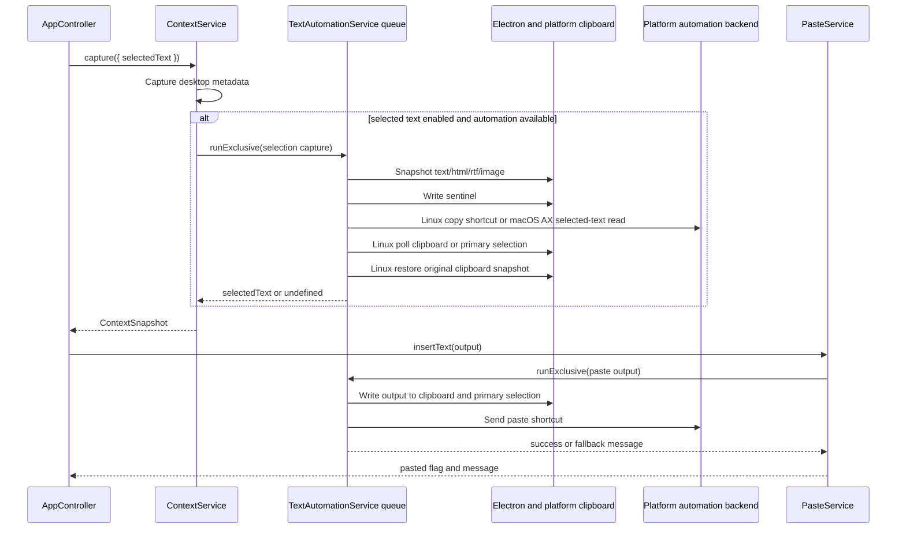

# Context and Automation

Context capture combines active-window metadata, selected text, and recent clipboard text. Paste automation uses the same serialized text-automation queue so copy and paste shortcuts do not overlap.

## Desktop Metadata

[`DesktopMetadataService`](../../src/main/services/context-metadata.ts) supports Linux metadata backends:

- X11 through `xdotool` and `xprop`.
- Hyprland through `hyprctl`.
- GNOME Shell through `gdbus` and `org.gnome.Shell.Eval`.
- KDE KWin through `qdbus` or `qdbus6` plus a temporary KWin script callback.

On macOS, app name and bundle id come from the frontmost application; window title is added only when Accessibility is trusted and the helper status check passes.

The capability report advertises active app metadata when at least one backend is detected.

## Selected Text

Selected-text capture only runs when enabled and text automation is available. Linux captures by copying the current selection, reading the clipboard or primary selection, and restoring the original clipboard snapshot. macOS captures through Accessibility selected-text attributes and does not use the clipboard for selected text.

## Paste Automation

[`LinuxTextAutomationService`](../../src/main/services/linux-text-automation.ts) orders candidate backends by desktop environment:

- Native helper when built and executable.
- `wtype` for wlroots Wayland sessions.
- `xdotool` for X11 or XWayland targets.
- `ydotool` when configured.
- XDG RemoteDesktop keyboard portal.

If every backend fails or none are available, Murmur leaves output on the clipboard and reports a fallback message.

On macOS, [`MurmurAutomationHelper.swift`](../../resources/macos/MurmurAutomationHelper.swift) handles CGEvent paste/copy emission, selected-text reads, window-title reads, and event-tap push-to-talk release detection. Electron main owns Accessibility prompting through `systemPreferences.isTrustedAccessibilityClient(true)`.
