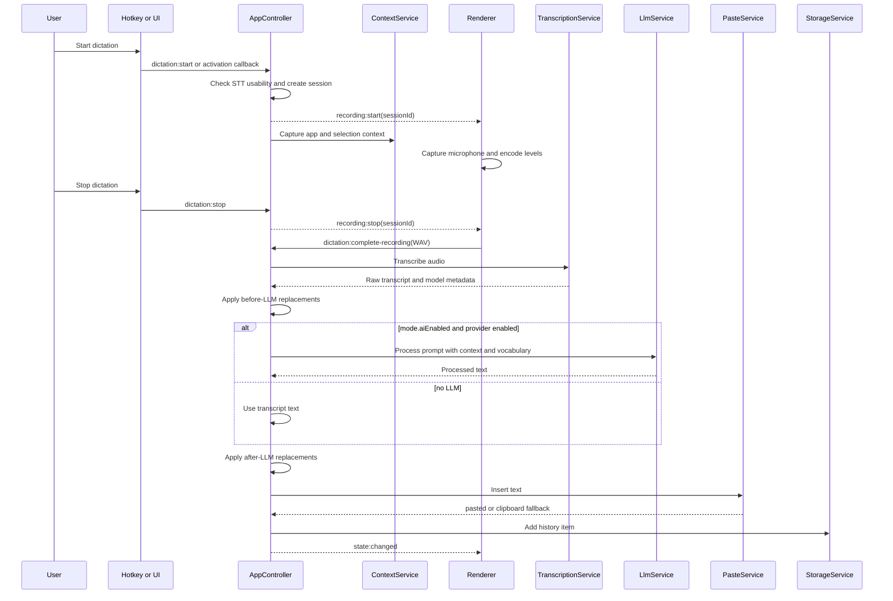

# Dictation Lifecycle

Dictation is coordinated by [`AppController`](../../src/main/app-controller.ts). Audio capture happens in the renderer, while STT, prompt construction, LLM processing, paste automation, and history writes happen in the main process.

## Session States

`DictationSession.status` moves through:

- `recording`
- `transcribing`
- `processing`
- `pasting`
- `complete`
- `cancelled`
- `error`

The controller blocks a new recording while `transcribing`, `processing`, or `pasting` is active.

## Processing Order

1. Capture context during recording.
2. Receive completed WAV from the renderer.
3. Transcribe audio through the selected STT provider.
4. Apply enabled replacements marked `runBeforeLlm`.
5. Build an LLM prompt from mode instructions, examples, vocabulary, transcript, and context.
6. If AI processing fails, fall back to the before-LLM transcript.
7. Apply enabled replacements marked `runAfterLlm`.
8. Paste or leave output on the clipboard.
9. Store history and optional retained audio.

## Extension Points

- Add new STT provider behavior in [`src/main/services/stt.ts`](../../src/main/services/stt.ts).
- Add prompt behavior in [`src/shared/prompts.ts`](../../src/shared/prompts.ts).
- Add replacement behavior in [`src/shared/replacements.ts`](../../src/shared/replacements.ts).
- Add paste backends behind [`TextAutomationService`](../../src/main/services/text-automation.ts).
