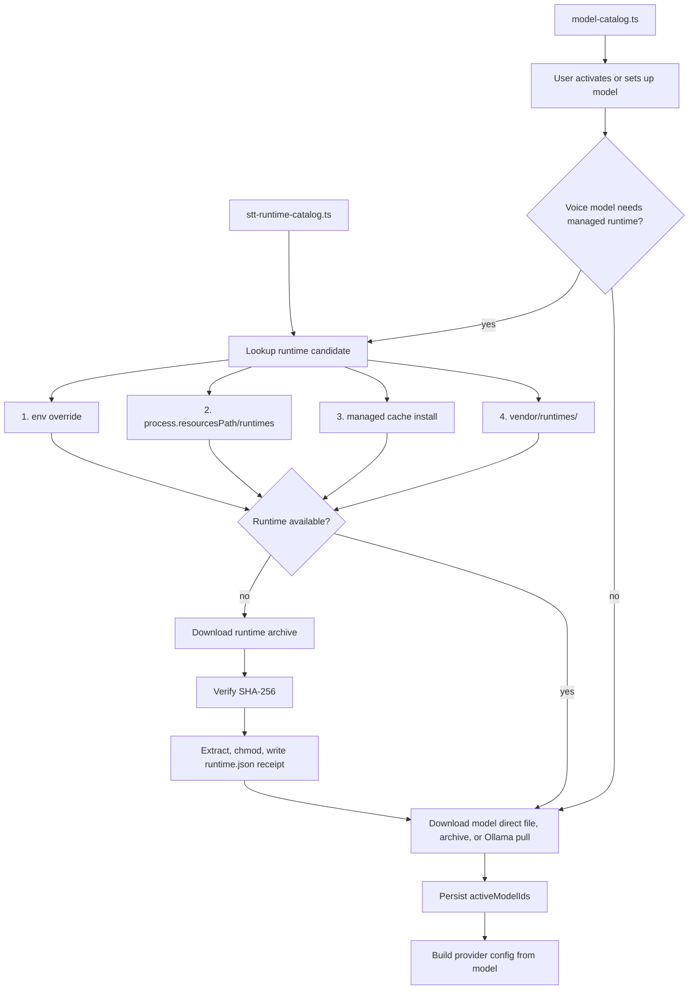

# Model Library and Runtimes

Model library code lives in [`src/main/services/model-library.ts`](../../src/main/services/model-library.ts). Runtime lookup, installation, receipts, and process environment setup live in [`src/main/services/stt-runtime.ts`](../../src/main/services/stt-runtime.ts).

## Runtime Lookup Order

For each runtime, Murmur checks:

1. `MURMUR_WHISPER_CPP_SERVER` or `MURMUR_SHERPA_ONNX_OFFLINE`.
2. `process.resourcesPath/runtimes/<platform-key>/<runtime-dir>/`.
3. Managed cache installs under `runtimes/stt/<platform-key>/<runtime-id>/<accelerator>/<runtime-bundle-semver>/`.
4. `vendor/runtimes/<platform-key>/<runtime-dir>/`.

Cache installs must include a matching `runtime.json` receipt and a supported executable. Corrupt or mismatched cache installs are reported as repairable only when a downloadable runtime archive URL is configured.

Packaged apps include CPU `whisper.cpp` and `sherpa-onnx` runtimes under `process.resourcesPath/runtimes/<platform-key>/`. Packaged CPU runtime repair is disabled; optional GPU runtime downloads are allowed only when the catalog pins a runtime-only release URL, size, and SHA-256.

## Runtime Install Flow

In development, prepare runtimes with `mise run runtimes:prepare`. If a future catalog entry includes a runtime archive URL, `SttRuntimeService.downloadRuntime()` can download that pinned archive, stream progress, verify SHA-256, extract to a staging directory, find the expected executable, chmod executables, write `runtime.json`, and atomically replace the final cache directory.

Before replacing a runtime, the controller stops any running runtime process for that runtime id.

## Model Download Flow

`ModelLibraryService` supports:

- `direct_file` downloads for Whisper GGML files.
- `archive` downloads for Sherpa ONNX model directories.
- `ollama_pull` for language models if catalog entries use it.
- `none` for cloud or externally managed models.

Model download states are persisted in the model library snapshot. Direct-file and archive downloads are refreshed against the cache on library reads.

Voice model files are not bundled with packaged apps. They remain user-cache downloads under the model directory.

## Local Runtime Behavior

`whisper.cpp` starts `whisper-server` on an ephemeral localhost port and reuses it while the same runtime and model key remains active. It is stopped after an idle timeout or runtime mutation.

`sherpa-onnx` runs `sherpa-onnx-offline` for each WAV transcription. Supported model layouts are NeMo CTC with `model.int8.onnx` or `model.onnx` plus `tokens.txt`, and NeMo transducer with encoder, decoder, joiner ONNX files plus `tokens.txt`.
