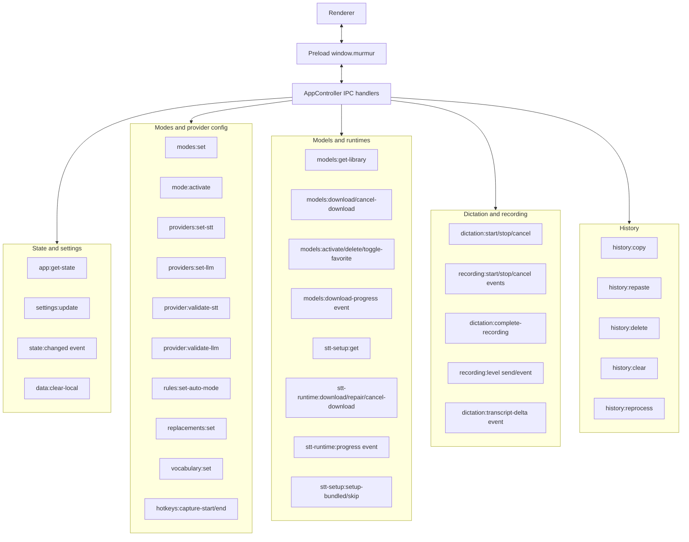

# Processes and IPC

The renderer never imports Electron directly. [`src/preload/index.ts`](../../src/preload/index.ts) exposes `window.murmur`; [`src/renderer/src/lib/murmur-client.ts`](../../src/renderer/src/lib/murmur-client.ts) wraps it and validates responses with shared schemas.

## Request Pattern

Most invoke handlers mutate storage or service state, broadcast `state:changed`, and return a fresh `AppStateSnapshot`. Model library and runtime setup calls can return narrower snapshots for optimistic renderer updates.

## Event Pattern

Long-running work reports progress through events:

- `models:download-progress` updates one `ModelDownloadState`.
- `stt-runtime:progress` updates one `SttRuntimeInstallState`.
- `dictation:transcript-delta` streams completed-audio STT deltas when available.
- `recording:level` is sent by the renderer during recording and forwarded to the pill window.

The full API surface is listed in [IPC API](../reference/ipc-api.md).
