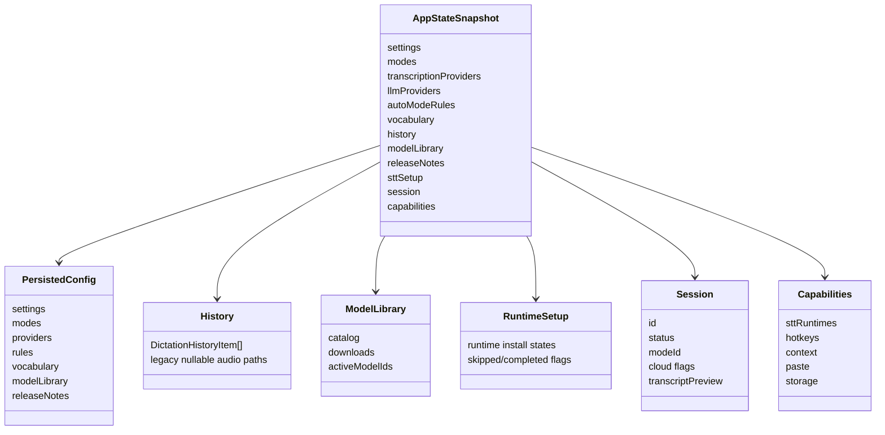

# State and Storage

State shape is defined in [`src/shared/types.ts`](../../apps/desktop/src/shared/types.ts). Persistence is implemented in [`src/main/services/storage.ts`](../../apps/desktop/src/main/services/storage.ts), and paths are resolved in [`src/main/services/app-paths.ts`](../../apps/desktop/src/main/services/app-paths.ts).

## Persistence

Configuration is stored as JSON at `configPath`. History uses SQLite when `node:sqlite` is available and falls back to JSON otherwise. The SQLite backend stores a `dictations` table and a `dictations_fts` virtual table, but current reads load the latest 2000 serialized history records.

`StorageService` normalizes legacy settings, modes, providers, and model library state on read. History mutations delete legacy linked audio files only when the audio path is under the configured audio directory.

## Snapshot Composition

`AppController.getSnapshot()` combines persisted state with:

- Current `sttSetup` from `SttSetupService`.
- Current in-memory `session`.
- Current capabilities from runtime, STT, hotkey, context, paste, and storage services.

This means not every field in `AppStateSnapshot` is persisted directly.

## Local Data Reset

`data:clear-local` resets config and history to defaults, removes legacy linked audio files, reopens storage, reregisters hotkeys, and broadcasts a fresh snapshot. It does not delete downloaded model files or runtime cache files.
