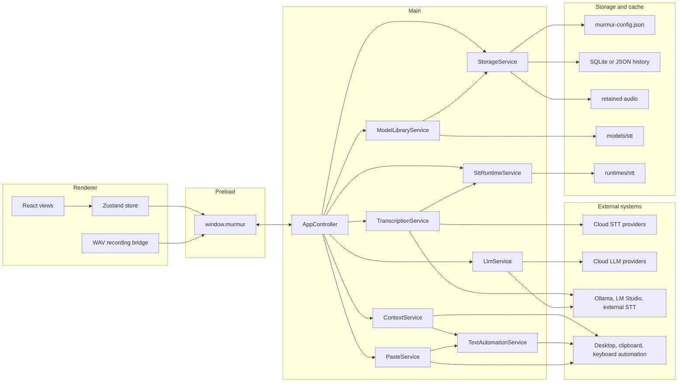

# System Overview

Key source files:

- [`src/main/app-main.ts`](../../src/main/app-main.ts) starts the Electron app and owns single-instance behavior.
- [`src/main/app-controller.ts`](../../src/main/app-controller.ts) wires windows, IPC, hotkeys, state snapshots, and services.
- [`src/preload/index.ts`](../../src/preload/index.ts) exposes the `window.murmur` bridge.
- [`src/renderer/src/lib/murmur-client.ts`](../../src/renderer/src/lib/murmur-client.ts) validates bridge responses for the renderer.

The main process is the only process that touches Node APIs, native runtime processes, filesystem storage, desktop metadata, and clipboard automation. Renderer code receives a validated `AppStateSnapshot` and calls typed methods through the preload API.

## Failure Modes

- Missing STT setup blocks recording before the renderer starts microphone capture.
- Provider validation failures stay local to configuration until the user tries to use that provider.
- Paste automation failure leaves the final output on the clipboard and records the failure message in session state.
- SQLite initialization failure falls back to JSON history storage.

## Extension Points

- Add new provider types in shared types, defaults, and the STT or LLM services.
- Add new model catalog entries in [`src/shared/model-catalog.ts`](../../src/shared/model-catalog.ts).
- Add runtime archive metadata in [`src/shared/stt-runtime-catalog.ts`](../../src/shared/stt-runtime-catalog.ts).
- Add desktop automation backends behind [`TextAutomationBackend`](../../src/main/services/text-automation.ts).
