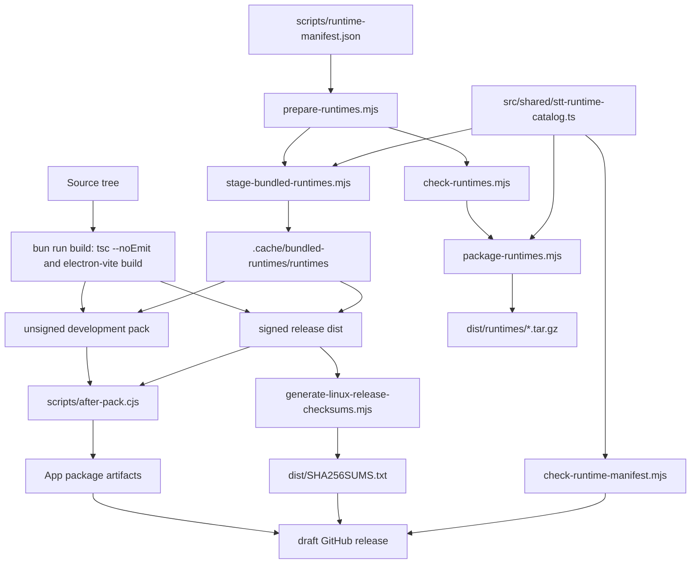

# Release and Packaging

Packaging uses Electron Vite for build output and `electron-builder` for app artifacts. Version tags create draft GitHub releases with Linux and macOS artifacts plus one checksum manifest; releases are not published automatically.



## App Packaging Commands

For local release preparation without pushing a tag or creating a GitHub release:

```sh
bun run release:prepare
```

The preparation helper verifies the release version and `docs/releases/<version>.md`, checks the git worktree, runs verification steps, prepares bundled STT runtimes, builds current-platform app artifacts, packages current-platform runtime archives, and writes `dist/SHA256SUMS.txt`. It does not edit tracked files, create release notes, commit, tag, push, or call `gh release`.

The helper writes only ignored generated output under paths such as `apps/desktop/out/`, `dist/`, `.cache/bundled-runtimes/`, `vendor/runtimes/`, and `resources/bin/*`. For available skips and non-interactive mode:

```sh
bun run release:prepare -- --help
```

```sh
bun run pack          # explicitly unsigned development app directory
bun run dist          # explicitly unsigned development artifacts
bun run dist:release  # signed and notarized release artifacts
```

`pack` runs:

```sh
bun run build
bun run native-helpers:build
bun run runtimes:manifest-check
bun run runtimes:stage
env CSC_IDENTITY_AUTO_DISCOVERY=false electron-builder --dir --config electron-builder.dev.cjs
```

`dist` uses the same explicitly unsigned development profile. `dist:release` uses `electron-builder.release.cjs`, requires macOS signing and notarization credentials on Darwin, and enables hardened runtime, entitlements, Developer ID signing, notarization, and stapling through electron-builder. It then fails the build unless `codesign`, `stapler`, and Gatekeeper all validate the packaged app.

The `build` block in `package.json` sets:

- `appId: dev.kumaraarav.murmur`
- `afterPack: scripts/after-pack.cjs`
- `productName: Murmur`
- `desktopName: dev.kumaraarav.murmur`, shared by the Linux desktop filename, `StartupWMClass`, runtime desktop name, and portal registration
- Linux distributable targets: `AppImage`, `deb`, and `rpm`
- Linux desktop-name syncing for installed package integration
- Linux package category: `Utility`
- Linux package maintainer: `Kumar Aarav <kumaraarav@kumaraarav.dev>`
- macOS development targets: explicitly unsigned `dmg` and `zip`
- macOS release targets: Developer ID signed, hardened, notarized, and stapled `dmg` and `zip`
- macOS minimum system version: `13.0`
- macOS microphone usage description in `Info.plist`
- packaged files from `apps/desktop/out/**` and `apps/desktop/package.json`
- extra resources `resources/bin/linux-fast-paste` and `resources/bin/murmur-macos-helper` under `bin/`
- extra resource `.cache/bundled-runtimes/runtimes` to `runtimes`

`pack` and `dist` require prepared runtimes for the target platform. Run `bun run runtimes:prepare` first; staging fails before `electron-builder` if either runtime executable is missing.

Building the `rpm` target also requires the host system to provide `rpmbuild`.

## Draft GitHub Releases

Pushing a SemVer app version tag creates a draft GitHub Release. The workflow lives at [`.github/workflows/release.yml`](../../.github/workflows/release.yml) and runs on tags that start with a numeric SemVer core, such as `0.1.0`.

Before pushing a release tag:

1. Update `apps/desktop/package.json` to the release version.
2. Add meaningful release notes at `docs/releases/<version>.md`.
3. Commit the version and release notes.
4. Push the matching tag, for example:

```sh
git tag 0.1.0
git push origin 0.1.0
```

The workflow verifies that the tag matches `apps/desktop/package.json`, requires the release notes file, runs root lint and tests across both workspaces, runs `bun audit --audit-level=moderate`, checks configured runtime release URL reachability, prepares bundled STT runtimes, builds Linux `AppImage`, `deb`, and `rpm` plus macOS `dmg` and `zip` artifacts on pinned Intel and Apple Silicon runners, generates `SHA256SUMS.txt`, verifies the checksums, and creates a draft release with those files attached.

## Checksums and Signing

`electron-builder` writes SHA-512 values into `dist/latest-linux.yml` for updater metadata. Treat that file as update-channel metadata, not as the release checksum policy for people downloading packages directly.

For every release, publish an explicit SHA-256 manifest next to the package artifacts:

```sh
bun run dist:release
node scripts/generate-linux-release-checksums.mjs
```

The checksum script writes `dist/SHA256SUMS.txt` with deterministic, sorted entries for:

- top-level `dist/*.AppImage`, `dist/*.deb`, `dist/*.rpm`, `dist/*.dmg`, and `dist/*.zip` packages
- `dist/runtimes/*.tar.gz` runtime archives when those archives exist and are being published

It intentionally excludes updater metadata, `.blockmap` files, and other metadata files. Regenerate `SHA256SUMS.txt` after any rebuild or artifact replacement, and publish the checksum file with the artifacts it describes.

To verify a staged release locally before upload:

```sh
cd dist
sha256sum -c SHA256SUMS.txt
```

Release signing is platform-specific:

- AppImage artifacts are not signed.
- `.deb` packages are not signed, and no signed apt repository metadata is produced.
- `.rpm` packages are not signed, and `rpmsign` is not configured.
- `bun run dist` remains an explicitly unsigned development path on macOS.
- `bun run dist:release` fails closed on macOS unless `CSC_LINK`, `CSC_KEY_PASSWORD`, `APPLE_ID`, `APPLE_APP_SPECIFIC_PASSWORD`, and `APPLE_TEAM_ID` are configured. The tag workflow maps these from `MACOS_CSC_LINK`, `MACOS_CSC_KEY_PASSWORD`, `MACOS_APPLE_ID`, `MACOS_APP_SPECIFIC_PASSWORD`, and `MACOS_TEAM_ID` repository secrets.
- The macOS release profile enables hardened runtime and entitlements; electron-builder performs Developer ID signing, notarization, and stapling.
- No project GPG release-signing key is configured, so detached signatures such as `SHA256SUMS.txt.asc` are not generated.

If a release-signing key is added later, sign the checksum manifest with a detached signature and publish the public key fingerprint in the release notes. Package-level signing for `.deb` repository metadata or `.rpm` packages should be configured as a separate release step rather than implied by the checksum manifest.

## Linux afterPack Launcher

[`scripts/after-pack.cjs`](../../scripts/after-pack.cjs) runs only for Linux. It renames the Electron binary to `<binary>-app`, writes a shell launcher at the original binary path, and forces `--ozone-platform=x11` when a Wayland session is detected. The launcher also reads user flags from `${XDG_CONFIG_HOME:-$HOME/.config}/<binary>-flags.conf`.

## Runtime Artifacts

Runtime binaries are prepared manually with the runtime scripts before packaging. Supported runtime platform keys are:

- `linux-x64`
- `darwin-arm64`
- `darwin-x64`

For the current platform, run:

```sh
bun run runtimes:prepare
bun run runtimes:doctor
bun run runtimes:stage
bun run runtimes:package
```

`runtimes:stage` copies CPU runtime files from `vendor/runtimes/<platform-key>/` into `.cache/bundled-runtimes/runtimes/<platform-key>/` for inclusion under `<process.resourcesPath>/runtimes/` in packaged apps. Accelerated runtime variants are optional assets published on runtime-only GitHub releases, separate from app releases, and are downloaded into the user cache only when their catalog URL, size, and SHA-256 are configured.

`runtimes:package` writes archives to `dist/runtimes/*.tar.gz`.

Runtime archive metadata used by the app is pinned in [`src/shared/stt-runtime-catalog.ts`](../../apps/desktop/src/shared/stt-runtime-catalog.ts). Build inputs are defined in [`scripts/runtime-manifest.json`](../../scripts/runtime-manifest.json).
