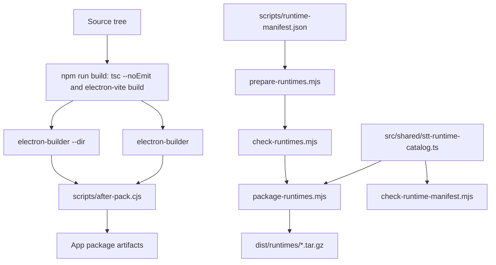

# Release and Packaging

Packaging uses Electron Vite for build output and `electron-builder` for app artifacts. Runtime archives can be built manually when needed, but this project does not currently publish release artifacts automatically.



## App Packaging Commands

```sh
mise run pack
mise run dist
```

`pack` runs:

```sh
npm run build
npm run runtimes:manifest-check
electron-builder --dir
```

`dist` runs the same build and manifest check, then invokes `electron-builder`.

The `build` block in `package.json` sets:

- `appId: dev.murmur.app`
- `afterPack: scripts/after-pack.cjs`
- packaged files from `out/**` and `package.json`
- extra resource `resources/bin/linux-fast-paste` to `bin/linux-fast-paste`

## Linux afterPack Launcher

[`scripts/after-pack.cjs`](../../scripts/after-pack.cjs) runs only for Linux. It renames the Electron binary to `<binary>-app`, writes a shell launcher at the original binary path, and forces `--ozone-platform=x11` when a Wayland session is detected. The launcher also reads user flags from `${XDG_CONFIG_HOME:-$HOME/.config}/<binary>-flags.conf`.

## Runtime Artifacts

Runtime archives are prepared manually with the runtime scripts when a development build needs them. Supported runtime platform keys are:

- `linux-x64`
- `linux-arm64`
- `darwin-x64`
- `darwin-arm64`
- `win32-x64`

For the current platform, run:

```sh
mise run runtimes:prepare
mise run runtimes:doctor
mise run runtimes:package
```

`runtimes:package` writes archives to `dist/runtimes/*.tar.gz`.

Runtime archive metadata used by the app is pinned in [`src/shared/stt-runtime-catalog.ts`](../../src/shared/stt-runtime-catalog.ts). Build inputs are defined in [`scripts/runtime-manifest.json`](../../scripts/runtime-manifest.json).
